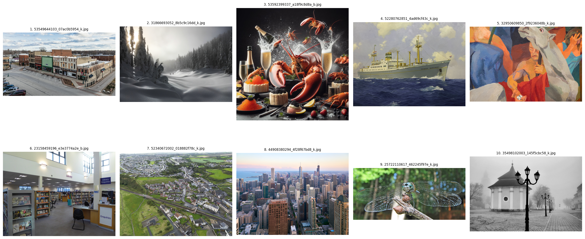
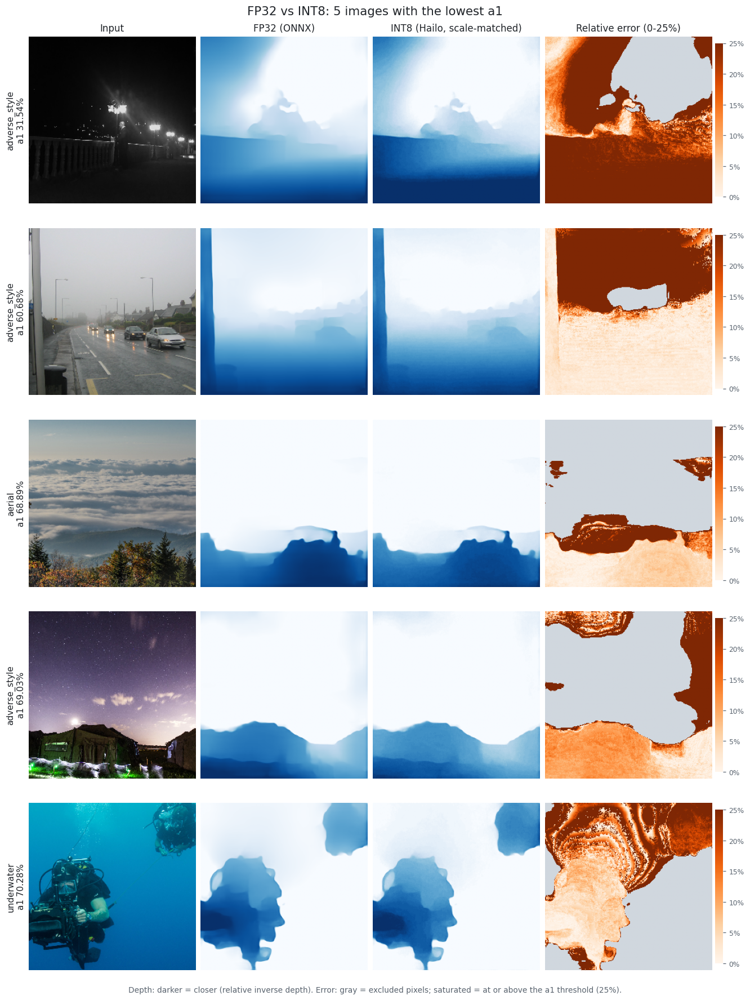
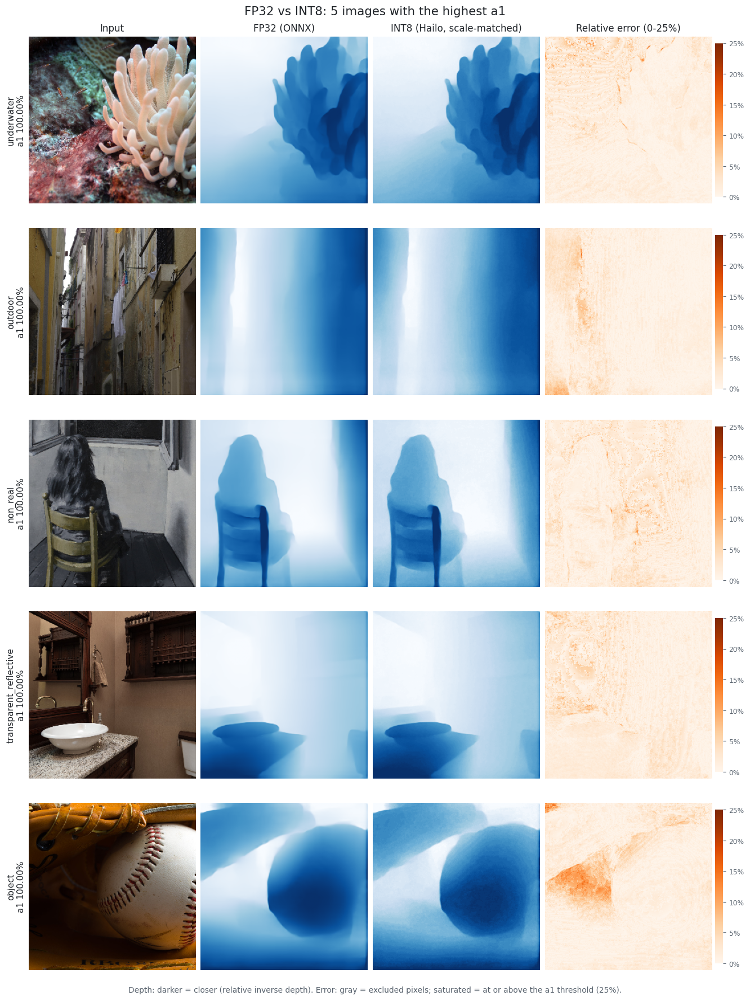

# Hailo NPU용 MiDaS v2.1 Small 모델 양자화

[English](README.en.md)

## 1. 프로젝트 개요

### 1.1 목표
* Depth estimation 모델(MiDaS v2.1 Small)을 양자화해서 Hailo NPU에 배포할 수 있도록 최적화함

## 2. 데이터셋

* **데이터셋**: depth estimation 평가용 DA-2K. 정답(annotation)은 쓰지 않고 이미지만 사용함
* **선정 이유**:
    - 단안 깊이 추정(monocular depth)에서 SOTA중 하나인 Depth Anything에서 평가용으로 사용한 데이터셋임
    - 8개 카테고리(실내, 실외, 수중, 항공, 물체, 투명·반사, 비현실, 악조건)의 장면이 고루 포함돼 있어서, 특정 장면에 치우친 평가를 줄일 수 있음 (카테고리별 67~195장)
* **전처리**: 비율 유지 리사이즈(짧은 변 300) → 가운데 256×256 crop → [0, 1] 스케일링. ImageNet mean/std 정규화는 ONNX 그래프 안(Sub/Div)에 포함돼 있어서 별도로 하지 않음
* **전체 샘플 수**: 1,033장

## 3. 모델 구조
* **모델**: MiDaS v2.1 Small (256x256)
* **입력 shape**: [1, 3, 256, 256]
* **출력 shape**: [1, 256, 256] (상대 역깊이, relative inverse depth)

### 3.1 모델 선정 이유
* MiDaS v2.1 Small은 처음부터 온디바이스 배포를 목적으로 만든 경량 모델임
* 아키텍처가 CNN 기반이라 양자화에 유리하다고 판단함. Hailo Dataflow Compiler 문서도 CNN을 기준으로 설명하고 있어서, 하드웨어에 맞춰 양자화하기 수월할 것으로 봄

## 4. 양자화 방법

### 4.1 파이프라인
| 단계 | 스크립트 | 설명 |
|---|---|---|
| Parse | `src/parse.py` | ONNX → HAR (FP). opset 10의 `Resize`를 `asymmetric` 모드로 명시한 뒤 파싱 (5.2 참고) |
| Quantize | `src/quantize.py` | HAR → INT8 HAR (아래 model script 사용) |
| Evaluate | `src/evaluate.py` | ONNX FP32와 Hailo 에뮬레이터의 각 단계(`native`, `fp_optimized`, `quantized`) 비교 |

```bash
./run_pipeline.sh                  # parse -> quantize -> evaluate (결과: runs/<timestamp>/)
./run_pipeline.sh parse evaluate   # 파싱 확인만
./run_pipeline.sh -h               # 전체 옵션
```

### 4.2 설정 (최종 모델)
| 항목 | 설정 |
|---|---|
| Optimization level | 4 (`compression_level=0`이라 모든 레이어가 8-bit) |
| Calibration | 1,024장, batch size 32 |
| Pre-quantization | Equalization, 전체 레이어 weights clipping (MMSE) |
| Post-quantization | Adaround (`train_all`, 320 epoch, 1,024장, level 4 기본값) → Fine-tuning (5 epoch, 1,024장, lr 1e-5) |
| 사용 안 함 | layer noise analysis checker (진단용이라 제외) |

```
model_optimization_flavor(optimization_level=4, compression_level=0, batch_size=32)
model_optimization_config(calibration, batch_size=32, calibset_size=1024)
model_optimization_config(checker_cfg, policy=disabled)
pre_quantization_optimization(equalization, policy=enabled)
pre_quantization_optimization(weights_clipping, layers={*}, mode=mmse)
post_quantization_optimization(finetune, policy=enabled, learning_rate=0.00001, epochs=5, dataset_size=1024)
```

## 5. 실험 결과

### 5.1 평가 방법
* **기준(reference)**: 원본 ONNX FP32 모델(onnxruntime)의 출력. DA-2K 1,033장에 같은 전처리를 적용함.
    - 따라서 이 점수는 실제 깊이에 대한 정확도가 아니라 **FP32 모델과 INT8 모델의 일치도**를 나타냄.
* **스케일 맞춤**: 이미지마다 예측값의 중앙값이 기준값의 중앙값과 같아지도록 scale만 맞춤 (KITTI 방식 median scaling). bias(shift)는 맞추지 않음
* **단계별 비교** (`src/evaluate.py`): Hailo 에뮬레이터의 각 단계를 바로 앞 단계와 비교함
  * ONNX → HAR `native`: 파싱(ONNX → HAR 변환) 손실
  * `native` → `fp_optimized`: FP 최적화(equalization 등) 손실
  * `fp_optimized` → `quantized`: INT8 양자화 손실
* Calibration 데이터와 평가 데이터가 같은 1,033장임.

### 5.2 파싱 문제: Resize 좌표 모드 불일치
파이프라인 초기 버전의 결과는 a1 = 81.94% (ONNX FP32 대 INT8)였음. 단계별로 나눠 보니 손실의 대부분이 **양자화 이전**, ONNX를 HAR로 파싱하는 단계에서 발생했음.

* MiDaS ONNX는 opset 10으로 export됨. opset 10의 `Resize`에는 `coordinate_transformation_mode` 속성이 없고, 항상 `asymmetric`으로 동작함.
* Hailo 파서는 이 속성이 없으면 opset 11의 기본값인 `half_pixel`로 간주함.
* 그 결과 디코더의 2배 bilinear 업샘플링 5개가 어긋난 위치에서 샘플링했음. 이 어긋남이 5단계에 걸쳐 누적돼서 출력이 몇 픽셀씩 밀림.
* **해결** (`src/parse.py`): 파싱 전에 모델을 opset 11로 변환하면서 `asymmetric` 모드를 명시함. 변환된 ONNX의 출력은 원본과 완전히 같고, Hailo는 resize 레이어를 `disabled`(= asymmetric)로 파싱함.

| ONNX FP32 → HAR `native` (FP) | a1 | a1 중앙값 | a1 하위 5% |
|---|---|---|---|
| 수정 전 (`half_pixel`) | 83.28% | 86.55% | 56.60% |
| 수정 후 (`asymmetric`) | **99.95%** | 100.00% | 99.76% |

### 5.3 정량 평가 (최종 INT8 모델)
최종 설정: Hailo `optimization_level=4` (Adaround `train_all`, 320 epoch, 1,024장), equalization, MMSE weights clipping, fine-tuning 5 epoch (lr 1e-5), `compression_level=0` (모든 레이어 8-bit).

| 지표 | HAR FP32 → INT8<br>(양자화만) | ONNX FP32 → INT8<br>(전체) |
|---|---|---|
| abs_rel | 0.082 | 0.085 |
| rms | 18.25 | 18.24 |
| **a1** (δ < 1.25) | **96.34%** | **96.34%** |
| **a2** (δ < 1.25²) | **98.46%** | **98.46%** |
| **a3** (δ < 1.25³) | **98.96%** | **98.96%** |
| a1 중앙값 (이미지별) | 97.98% | 97.99% |
| a1 하위 5% (이미지별) | 87.21% | 87.24% |

* rms 단위는 모델 출력(상대 역깊이) 단위.
* sq_rel과 log_rms는 현재 구현이 표준 정의와 달라서 제외함 (sq_rel은 gt²로 나누고, log_rms는 스케일을 맞추지 않은 예측값을 사용함).

**수정 전후 비교 (ONNX FP32 → INT8, 전체)**

| | a1 | a1 하위 5% |
|---|---|---|
| 초기 파이프라인 (resize 불일치) | 81.94% | 56.10% |
| 현재 파이프라인 | **96.34%** | **87.24%** |

### 5.4 Adaround 비교 실험
아래 실험은 모두 파싱 수정, equalization, MMSE weights clipping, 5 epoch fine-tuning을 똑같이 적용함. 점수는 HAR FP → INT8 기준.

| Adaround (epoch / 이미지 수) | Fine-tune lr | a1 | a1 중앙값 | a1 하위 5% | Adaround 소요 시간 |
|---|---|---|---|---|---|
| 없음 | 1e-4 | 75.90% | 79.99% | 40.76% | – |
| 50 / 256 | 1e-4 | 83.97% | 88.16% | 51.89% | 29분 |
| 200 / 256 | 1e-4 | 93.78% | 96.58% | 79.55% | 1시간 10분 |
| 320 / 256 | 1e-4 | 94.34% | 96.72% | 80.38% | 1시간 44분 |
| 320 / 1,024 (level 4 기본값) | 1e-5 | **96.34%** | **97.98%** | **87.21%** | 6시간 19분 |

* 위의 네 줄은 Adaround epoch만 다름. Adaround의 효과가 크고, 200 epoch 이후로는 거의 포화됨 (200 → 320에서 +0.56%p).
* 마지막 줄은 Adaround 이미지 수와 fine-tune lr이 동시에 바뀌어서, +2.0%p 향상이 둘 중 어느 쪽 덕분인지 구분할 수 없음.
* 소요 시간은 RTX 4090, NVIDIA DALI 미설치 환경 기준.

### 5.5 모델 크기 비교
| 지표 | Full Precision (ONNX) | Quantized (INT8 HEF) | 크기 감소율 |
|--------|---|---|---|
| 파일 크기 | 63.67 MB | 19.81 MB | **68.9%** |

* 최종 모델을 컴파일한 HEF 기준 (`runs/20260929_232724_addADAoptiLV4_addFine/Midas_quantize_model.hef`). 1 MB = 1024² bytes.

### 5.6 정성 평가
* FP32(ONNX)와 INT8(Hailo 에뮬레이터) depth map을 이미지별 a1 기준 하위 5장, 상위 5장으로 비교함. 각 줄은 입력 | FP32 | INT8 | 상대 오차(0~25%) 순서임.
    - 가운데 두 열(FP32, INT8)의 depth map은 진한 파란색일수록 카메라에 가까움.
    - 상대 오차 히트맵에서 회색은 원본(FP32) 출력이 0이라 평가에서 제외된 픽셀이고, 가장 붉은색은 오차가 25% 이상으로 a1 기준을 벗어난 픽셀임.

**하위 5장**

* 하위 5장은 야간, 안개, 하늘, 수중처럼 먼 영역이 넓은 장면이며, 수중 1장을 빼면 모두 야외임. 오차는 대부분 이 먼 영역에 몰려 있음.
* MiDaS는 거리의 역수(역깊이)를 출력하므로 먼 곳일수록 값이 0에 가까워짐. a1은 상대 오차 기준이라 이런 작은 값에서 양자화 오차가 크게 잡히고, 그 결과 먼 영역이 넓은 장면에서 점수가 낮게 나오는 것으로 봄.

**상위 5장**

* 상위 5장은 실내·실외가 섞여 있어서, 실내/실외 여부 자체는 점수와 관계가 적은 것으로 추정함.
* 대신 화면 대부분이 가까운 물체나 벽으로 채워져 있고 먼 영역이 적음. 가까운 물체처럼 상대적인 깊이를 가늠할 단서가 많은 장면일수록 a1이 높게 나오는 것으로 추정함.

**정리**
1. 먼 영역이 넓은 야외 장면은 a1 점수가 낮게 나옴. 다만 멀다는 정도의 정보만 필요한 용도라면 실사용에는 큰 문제가 되지 않을 것으로 봄.
2. 상대 깊이를 가늠하는 용도라면, 벤치마크 점수와 별개로 양자화 전후 depth map의 차이는 육안으로 거의 구분되지 않음.

## 6. 결론

* opset 10의 `Resize` 레이어가 다른 좌표 모드(`asymmetric` 대신 `half_pixel`)로 파싱돼서, FP 상태에서도 Hailo 모델의 출력이 몇 픽셀씩 밀렸음 (a1 83.28%). 이를 수정해서 ONNX 대 HAR FP 일치도를 99.95%로 올림.
* 에뮬레이터 단계(ONNX → native → fp_optimized → quantized)를 하나씩 비교해서 파싱 손실과 양자화 손실을 분리함. 전체 점수만 봤다면 원인을 잘못 짚었을 것임.
* 실험한 설정 중 Adaround의 영향이 가장 컸음. Adaround epoch만 0에서 320으로 늘렸을 때 a1이 75.90%에서 94.34%로 오름.
* **한계**: 기준이 실제 깊이 정답이 아니라 FP32 모델의 출력임. Calibration 이미지와 평가 이미지가 같음. 마지막 +2.0%p(level 4 실험)는 두 설정이 동시에 바뀌어서 원인을 분리하지 못함.


## 7. 참고 자료
- MiDaS 모델 : https://github.com/isl-org/MiDaS
- 평가 방법 : https://github.com/FangGet/tf-monodepth2
- DA-2K 데이터셋 : https://huggingface.co/datasets/depth-anything/DA-2K


**작성자**: [Jiwon Kim]  
**작성일**: [30 Sep 2026]  
